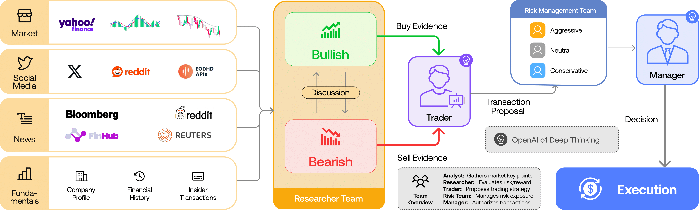
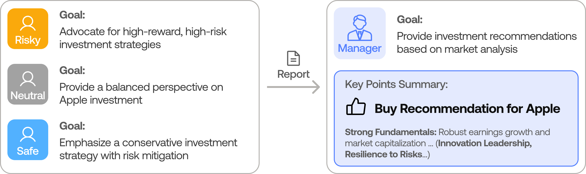

<p align="center">
  
</p>

<div align="center" style="line-height: 1;">
  <a href="https://arxiv.org/abs/2412.20138" target="_blank"></a>
  <a href="https://discord.com/invite/hk9PGKShPK" target="_blank"></a>
  <a href="./assets/wechat.png" target="_blank"></a>
  <a href="https://x.com/TauricResearch" target="_blank"></a>
  <br>
  <a href="https://github.com/TauricResearch/" target="_blank"></a>
</div>

---

# TradingAgents: Multi-Agents LLM Financial Trading Framework

> 🎉 **TradingAgents** officially released! We have received numerous inquiries about the work, and we would like to express our thanks for the enthusiasm in our community.
>
> 我们在原有框架基础上增加了对中国 A 股市场的支持，让这个强大的多智能体交易框架能够同时服务于国际市场和 A 股市场。期待与您一起构建有影响力的项目！

<div align="center">

🚀 [框架介绍](#tradingagents-framework) | ⚡ [安装与使用](#installation-and-cli) | 🌐 [Web 界面](#web-interface) | 📦 [包使用说明](#tradingagents-package) | 🤝 [贡献](#contributing) | 📄 [引用](#citation)

</div>

## TradingAgents Framework

TradingAgents 是一个模拟真实交易公司运作的多智能体交易框架。通过部署专业的 LLM 驱动的智能体：从基本面分析师、情绪专家到技术分析师，再到交易员和风险管理团队，平台协作评估市场状况并指导交易决策。这些智能体通过动态讨论来确定最佳策略。该框架同时支持国际市场（如美股）和中国 A 股市场的分析与交易。

<p align="center">
  
</p>

> TradingAgents 框架专为研究目的设计。交易表现可能受多种因素影响，包括所选语言模型、模型温度、交易周期、数据质量和其他非确定性因素。[不应作为金融、投资或交易建议。](https://tauric.ai/disclaimer/)

我们的框架将复杂的交易任务分解为专业角色。这确保了系统在市场分析和决策方面采用稳健、可扩展的方法。

### 分析师团队
- 基本面分析师：评估公司财务和业绩指标，识别内在价值和潜在风险。
- 情绪分析师：分析社交媒体和公众情绪，评估短期市场情绪。
- 新闻分析师：监控全球新闻和宏观经济指标，解读事件对市场的影响。
- 技术分析师：利用技术指标（如 MACD 和 RSI）检测交易模式并预测价格走势。

<p align="center">
  
</p>

### 研究员团队
- 由看多和看空研究员组成，他们对分析师团队提供的见解进行批判性评估。通过结构化辩论，平衡潜在收益和固有风险。

<p align="center">
  
</p>

### 交易员智能体
- 整合分析师和研究员的报告，做出明智的交易决策。根据全面的市场洞察确定交易时机和规模。

<p align="center">
  
</p>

### 风险管理和投资组合经理
- 通过评估市场波动性、流动性和其他风险因素，持续评估投资组合风险。风险管理团队评估和调整交易策略，向投资组合经理提供评估报告以做出最终决策。
- 投资组合经理批准/拒绝交易提案。如获批准，订单将发送至模拟交易所并执行。

<p align="center">
  
</p>

## Installation and CLI

### 安装

克隆 TradingAgents:
```bash
git clone https://github.com/TauricResearch/TradingAgents.git
cd TradingAgents
```

使用您喜欢的环境管理器创建虚拟环境：
```bash
conda create -n tradingagents python=3.13
conda activate tradingagents
```

安装依赖：
```bash
pip install -r requirements.txt
```

### 必需的 API

您需要 OpenAI API 或 QWEN API 来运行智能体。我们推荐使用 QWEN 模型，它在金融领域表现出色且支持中英双语：
```bash
# 使用 Qwen API
export QWEN_API_KEY=$YOUR_QWEN_API_KEY
# 或者使用 Doubao API
export DOUBAO_API_KEY=$YOUR_DOUBAO_API_KEY
```

```bash
# 向量模型 API，国内推荐使用火山引擎
export VOLCES_API_KEY=$YOUR_VOLCES_API_KEY
```

对于国际市场数据，您还需要 FinnHub API（免费版即可）：
```bash
export FINNHUB_API_KEY=$YOUR_FINNHUB_API_KEY
```

### CLI 使用

您可以直接运行 CLI：
```bash
python -m cli.main
```
您将看到一个界面，可以选择所需的股票代码（支持 A 股和美股）、日期、LLM、研究深度等。

<p align="center">
  
</p>

界面将显示结果加载过程，让您跟踪智能体的运行进度。

<p align="center">
  
</p>

<p align="center">
  
</p>

## Web Interface

我们提供了一个基于 Streamlit 的 Web 界面，使交易分析更加直观和便捷：

```bash
streamlit run app.py
```

Web 界面提供以下功能：
- 股票选择和日期设定（支持 A 股和美股）
- 实时分析进度展示
- 智能体状态监控
- 分析报告实时展示
- 交易决策可视化

## TradingAgents Package

### Implementation Details

We built TradingAgents with LangGraph to ensure flexibility and modularity. We utilize `o1-preview` and `gpt-4o` as our deep thinking and fast thinking LLMs for our experiments. However, for testing purposes, we recommend you use `o4-mini` and `gpt-4.1-mini` to save on costs as our framework makes **lots of** API calls.

### Python Usage

To use TradingAgents inside your code, you can import the `tradingagents` module and initialize a `TradingAgentsGraph()` object. The `.propagate()` function will return a decision. You can run `main.py`, here's also a quick example:

```python
from tradingagents.graph.trading_graph import TradingAgentsGraph
from tradingagents.default_config import DEFAULT_CONFIG

ta = TradingAgentsGraph(debug=True, config=DEFAULT_CONFIG.copy())

# forward propagate
_, decision = ta.propagate("NVDA", "2024-05-10")
print(decision)

# 分析 A 股
_, decision = ta.propagate("600519", "2024-05-10")  # 以贵州茅台为例
print(decision)
```

您也可以调整默认配置来设置自己的 LLM 选择、辩论轮数等：

```python
from tradingagents.graph.trading_graph import TradingAgentsGraph
from tradingagents.default_config import DEFAULT_CONFIG

# 创建自定义配置
config = DEFAULT_CONFIG.copy()
config["deep_think_llm"] = "qwen-plus"  # 使用 DeepSeek-R1 作为深度思考模型
config["quick_think_llm"] = "qwen-plus"  # 使用 DeepSeek-V3 作为快速思考模型
config["max_debate_rounds"] = 2  # 增加辩论轮数
config["online_tools"] = True  # 使用在线工具或缓存数据

# 使用自定义配置初始化
ta = TradingAgentsGraph(debug=True, config=config)

# 前向传播
_, decision = ta.propagate("600519", "2024-05-10")
print(decision)
```

您可以在 `tradingagents/default_config.py` 中查看完整的配置列表。

## Contributing

我们欢迎来自社区的贡献！无论是修复错误、改进文档还是提出新功能，您的投入都有助于使这个项目变得更好。如果您对这项研究感兴趣，请考虑加入我们的开源金融 AI 研究社区 [Tauric Research](https://tauric.ai/)。

## Citation

Please reference our work if you find *TradingAgents* provides you with some help :)

```
@misc{xiao2025tradingagentsmultiagentsllmfinancial,
      title={TradingAgents: Multi-Agents LLM Financial Trading Framework},
      author={Yijia Xiao and Edward Sun and Di Luo and Wei Wang},
      year={2025},
      eprint={2412.20138},
      archivePrefix={arXiv},
      primaryClass={q-fin.TR},
      url={https://arxiv.org/abs/2412.20138},
}
```
